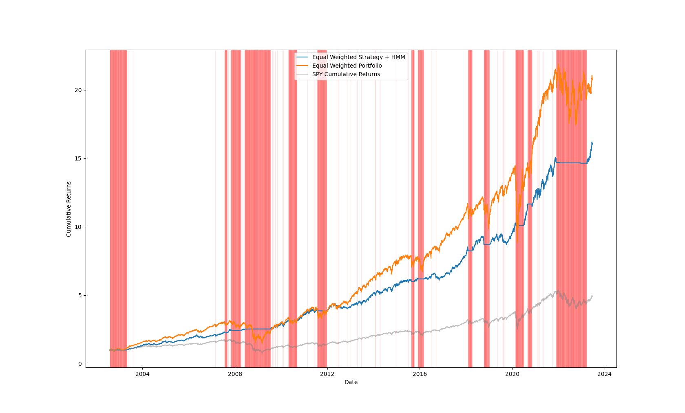

#### ATTENTION SURVIVORSHIP BIAS

# Crossectionnal trend following

This project is about building and testing a simple trend following strategy on all the stocks of the S&P500.
The goal is to study and experiment through the project, not ending with a wonderful trading strategy that will make us filthy rich. Hence it is not a financial advice.

## Trading strategy

It will be a long only strategy, the idea is the next:    
  - We Long the stock if the 5 period EMA is above the 200 period EMA,
  - Else we do nothing.
                                                          
## Asset allocation
Since this will be applied to every single stock of the S&P500 we will then construct a equally weighted portfolio with all the strategy returns of each individual stock.
Doing a portfolio will help to reduce the volatility, and also the drawdown by divesification. We could apply some mean variance annalysis/optimisation, but due to the computationnal intensity, this could be done in a future commit.

## Filtering for market state
Finally we used an Hidden Markov Model (HMM) to filter market states. 
*What is the utility of filtering bad market state when we are diversified ?* 
  
  - The covariance matrix is evolving through time and have specific dynamics through market regimes. When markets are in a bearish regime, covariance between asset will increase and the majority of the asset will have higher correlation with one an other, implying that the diversification effect would majorly vanish. Using the HMM to filter bullish and bearish state will help to minimize the portfolio exposition to bad market states.
    
  - By CAPM a well divesifed portfolio express only systematik risk, since we have eliminated the idiosincratic risk by diversification; in other words we need to control market risk in order to control the portfolio risk. The HMM will help us to filter the time where market are too risky and not rewarding for the actual risk.

# Methodology
## *How did we downloaded the data of the S&P500 stocks constituents ?*

We used the information given by wikipedia at the following link : https://en.wikipedia.org/wiki/List_of_S%26P_500_companies. once done we downloaded daily historical stock data for each tickers.
This implies one problem, it gives the list of todays stocks in the index, but not the list of all the stocks that where in the index during the year we are backtesting the strategy.
What does it implies in our context ?

1. The stock that are TODAY in the 500 biggest capitalisation of USA are the stocks that performed well in the past years, implying that it will artificially increase the preformance of our a Long only trend following strategy because we are buying past years winners. Backtesting the trend following strategy with these data would imply that we knew in the past which stock would be in the S&P500 today; alternatively do we know what stocks will be in the index in some years ? NOOOO WE DON'T !!!

2. Using the stock that are TODAY in the index to backtest our strategy would also imply that we would ignore the loser, it would imply that we knew in the past which stocks would be the losers in the future. Hence our trend following strategy will be artificially better because we will not long loser stocks.

This phenomena is called the **Survivorship Bias**.
To solve it: 
  - We could look for a dataset with the list of all the stocks constituents of the S&P500 at each date, then download and process the data to obtain a complete full data set without survivorship bias.
  - Use some data from data providers such as CRSP or other counterparty. But it is costly.
  - Try to find on the net, some free dataset without survivorship bias. But it is less reliable on the correctnes of the constituents.

## *Some notes on HMM*

To fit the HMM we used Daily SPY data from Yahoo finance form 1950 to 2002.
Then the foercast of the model have been made from 2003 to 2023.

We assigned 3 states:
1. Sell     => no trading
2. Neutral  => no trading
3. Buy      => trading the strategy

## *Some notes on the backtest period*

This strategy has been tested on daily data from 2003 to June 2023

# Results

Below you can see some three equity curve, 
- One is the strategy with HMM + equaly wheighted,
- Then you have a simple equaly wheighted portfolio made of the biased stock data, this way we would be able to compare the strategy effectivenes to some comparable benchmark,
- Finally you have the actual SPY cumulative return meaning the SPY isn't survivorshiply biased so we have something that get us back to reality.

The red background represents the moment where the HMM has forcasted a Neutral or a Sell state, hence we will not apply the strategy.

# Future improvement/commits :
- Getting survivorship bias free data, making a comparaision.
- Applying some mean variance analysis.
- Going deeper in the results of the strategy : Sharpe ratio; alpha, beta,

